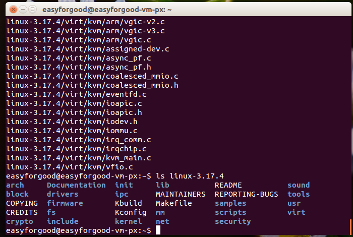
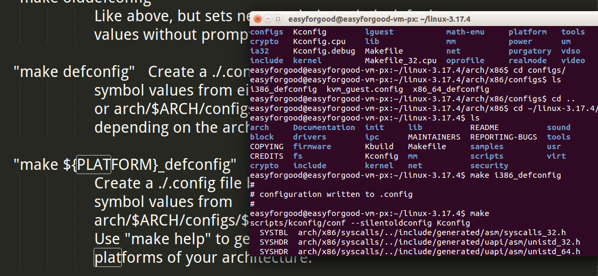
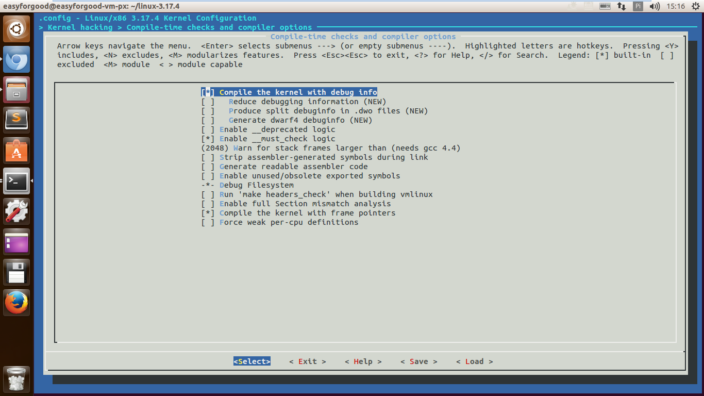
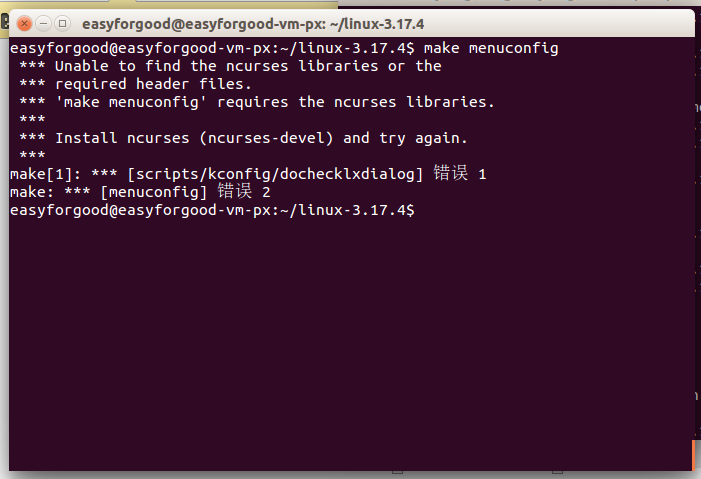
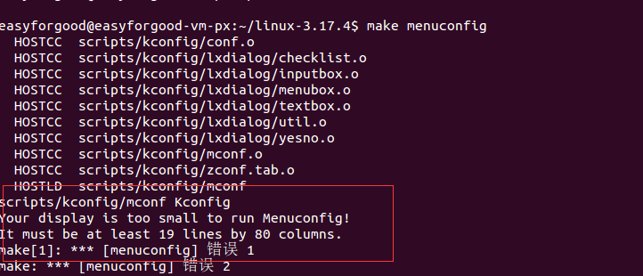



####朋翔 原创作品转载请注明出处《Linux内核分析》MOOC课程http://mooc.study.163.com/course/USTC-1000029000 

---

###一、实验步骤整理

1. 下载Linux-3.18.6
	
	[Linux-3.18.6.tar.xz下载地址](https://www.kernel.org/pub/linux/kernel/v3.x/linux-3.18.6.tar.xz)
	

2. 解压Linux

		xz -d linux-3.18.6.tar.xz
		tar -xvf linux-3.18.6.tar

查看项目文件夹：

3. 设置编译选项并编译内核

设置成i386的配置：
		
	make i386_defconfig 

截图：

进入图像化配置界面：

	make menuconfig

并设置成调试信息开启：

	kernel hacking—>
	[*] compile the kernel with debug info

截图：

最后编译（等待若干时间后）：

	make

####make menuconfig 遇到的问题：

- 提示 “unable to find ncurses libraries ...”

解决办法：安装 libncurses5-dev  

	sudo apt-get install libncurses5-dev

- Your display is too small to run menuconfig

解决方法：直接把窗口最大化就行了！

4. 制作根文件系统

		cd ~/LinuxKernel/
		mkdir rootfs
		git clone  https://github.com/mengning/menu.git
		cd menu
		gcc -o init linktable.c menu.c test.c -m32 -static –lpthread
		
		cd ../rootfs
		cp ../menu/init ./
		find . | cpio -o -Hnewc |gzip -9 > ../rootfs.img

（注：最后一步实际上是有三个部分组成 find命令 和cpio命令和 gzip命令 cpio是备份归档的命令，gzip是压缩）

5.  运行menuOS 并进行设置调试

启动：

		qemu -kernel linux-3.18.6/arch/x86/boot/bzImage -initrd rootfs.img
		
运行截图：

启动调试：

		qemu -kernel linux-3.18.6/arch/x86/boot/bzImage -initrd rootfs.img -s -S

注：

>  -S freeze CPU at startup (use ’c’ to start execution) 第一开始运行时停住
>  
>  -s shorthand for -gdb tcp::1234 若不想使用1234端口，则可以使用-gdb tcp:xxxx来取代-s选项

再开启另外一个shell，运行gdb

	gdb
	
	(gdb)file linux-3.18.6/vmlinux # 在gdb界面中targe remote之前加载符号表 
	
	(gdb)target remote:1234 # 建立gdb和gdbserver之间的连接,按c 让qemu上的Linux继续运行 
	
	(gdb)break start_kernel # 断点的设置可以在target remote之前，也可以在之后 

	(gdb)list 查看源代码
	
	(gdb)continue 继续运行到下一个断点

截图：
	
		
	

