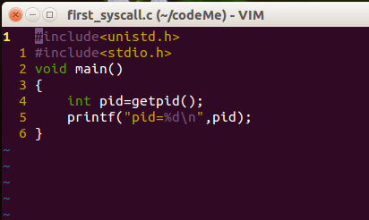
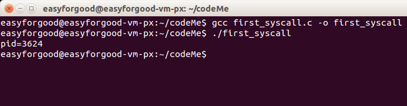



####朋翔 原创作品转载请注明出处《Linux内核分析》MOOC课程http://mooc.study.163.com/course/USTC-1000029000 

###一、 过程整理

我这里使用的系统调用是getpid() 用于获取当前的进程id，系统调用号是20（0x14）

直接截图：

- 使用库函数进行系统调用：

运行:

- 使用内嵌汇编系统调用：

运行：

（注：这里获取的pid是肯定不一样的，因为每次运行程序都会分配一个）

###二、 关于系统调用

####1.软中断 中断 和系统调用

首先系统调用是一种特殊的中断，是程序或者说是用户主动进行向内核请求服务的

硬件中断是一种电信号，当设备有某种事件发生时，它就会产生中断，通过总线把电信号发送给中断控制器。
如果中断的线是激活的，中断控制器就把电信号发送给处理器的某个特定引脚。处理器于是立即停止自己正在做的事，
跳到中断处理程序的入口点，进行中断处理。

但是我之前一直没分清楚软中断和系统调用的区别,
我又查了一下，觉得可能是这样的。

软中断是一种机制，由软件模拟中断**信号**主动申请来访问内核的服务，让内核帮助处理一些操作。

系统调用是一种具体的实现，可以由用户主动发出。

程序异常也是一种软中断，比如说缺页异常。

中断下半段的处理也是通过软中断实现的，通过ksoftirqd内核线程去处理未完成的操作

####2.系统调用的过程（源码分析）

在/linux-3.18.6/arch/x86/kernel/traps.c中 有系统调用的初始化：

		set_system_trap_gate(SYSCALL_VECTOR, &system_call);

调用**trap_init()**就会执行到这里。其中**SYSCALL_VECTOR  = 0x80** 因此我们就是通过 INT  0x80触发系统调用的。

系统调用时的处理函数是**asmlinkage int system_call(void);**

 system_call 具体的实现在内核加载的时候就已经加载到内存中了。

在/linux-3.18.6/arch/x86/kernel/entry_32.S 中 有system_call的实现：

	ENTRY(system_call)
	...
	
	SAVE_ALL
	
	....
	
	cmpl $(NR_syscalls), %eax
	...
	syscall_call:
		call *sys_call_table(,%eax,4)
	syscall_after_call:
		....
	syscall_exit:jne syscall_exit_work
		....

	restore_all:
		TRACE_IRQS_IRET
	restore_all_notrace:
	.....
	restore_nocheck:
		RESTORE_REGS 4			# skip orig_eax/error_code
	...
	ENDPROC(system_call)

实现可以分为三步看：

**1.保存现场，通用寄存器**
	
在硬件做完对 esp，eip ，eflags保存之后

我们可以清晰的看到 linux system_call 对 其他寄存器的保存 ---- **SAVE_ALL**

SAVE_ALL 的实现在文件最开始的地方：

	.macro SAVE_ALL
	cld
	PUSH_GS
	pushl_cfi %fs
	/*CFI_REL_OFFSET fs, 0;*/
	pushl_cfi %es
	/*CFI_REL_OFFSET es, 0;*/
	pushl_cfi %ds
	/*CFI_REL_OFFSET ds, 0;*/
	pushl_cfi %eax
	CFI_REL_OFFSET eax, 0
	pushl_cfi %ebp 
	....(省略)
	
**2.获取系统调用号（没注意到参数在哪里获取？）**

	cmpl $(NR_syscalls), %eax 

应该是比较系统调用号看是否存在吧

	call *sys_call_table(,%eax,4)

通过系统调用表跳转到具体的系统调用

**3.恢复现场**

	syscall_exit:jne syscall_exit_work

跳转到 **syscall_exit_work** 处理
最后一句是跳转到 jmp **resume_userspace** 

**resume_userspace** 最后一句是jmp **restore_all** 

（**注：这里无意中发现了  jmp restore_all之前会进行jne work_pending，这里会设置need_resched 判断调度！**）

然后发现RESTORE_ALL 这个宏实际上是存在的！老师骗人。！

**restore_all** 只执行了 TRACE_IRQS_IRET 用来判断中断是否关闭，若是关闭便打开

然后顺序执行 **restore_all_notrace:** 关键的 **RESTORE_REGS**  4

这才是真正的恢复现场！

	.macro RESTORE_INT_REGS
		popl_cfi %ebx
		CFI_RESTORE ebx
		popl_cfi %ecx
		CFI_RESTORE ecx
		popl_cfi %edx
		CFI_RESTORE edx
		popl_cfi %esi
		CFI_RESTORE esi
		popl_cfi %edi
		CFI_RESTORE edi
		popl_cfi %ebp
		CFI_RESTORE ebp
		popl_cfi %eax
		CFI_RESTORE eax
	.endm
	.macro RESTORE_REGS pop=0
		RESTORE_INT_REGS
	...
	
over		
	
先扒皮到这里。还有很多比如说**如何传参**以及如何**找到具体的系统调用函数**等等问题还没有解决。

####3.API函数的实现

简要说明下：

所有api函数都可以在
linux-3.18.6/arch/x86/syscalls/syscall_32.tbl 找到对应的系统调用处理函数
如：reboot - > sys_reboot

这些函数的绝大多数实现都在linux-3.18.6/kernel/sys.c

之前系统调用在内核中的入口也都是sys_xxx
现在都改为SYSCALL_DEFINE定义的了

具体请看：Linux系统调用之SYSCALL_DEFINE(http://blog.csdn.net/hxmhyp/article/details/22699669)

###三、总结

三层皮只是系统调用通过API实现的时候才会有的，封装例程包装了系统调用。但是实际上我们用内嵌汇编实现，和三层皮是没什么关系的。